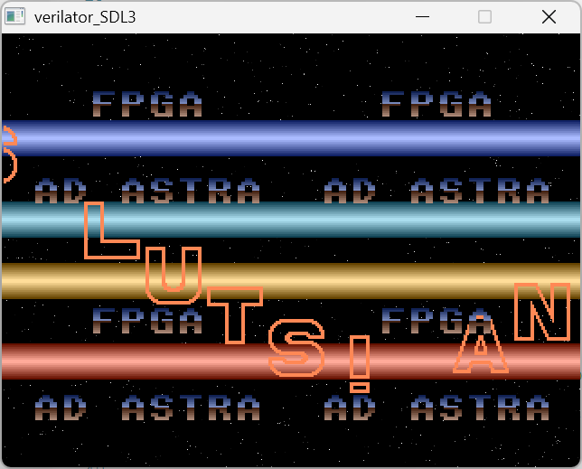
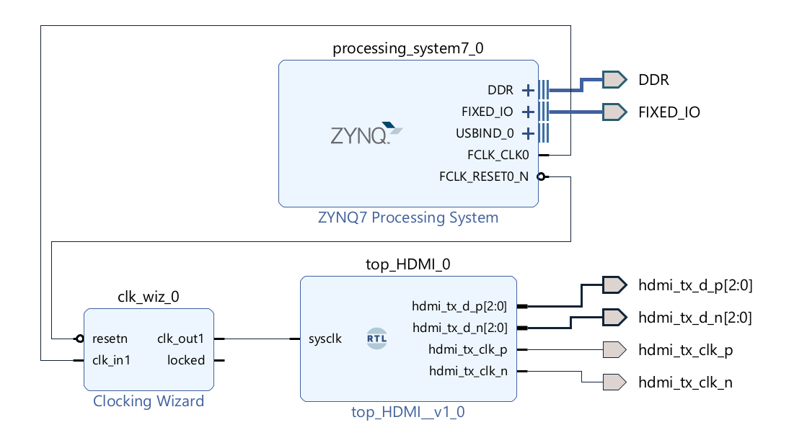

# "Cross-Platform" Graphics Demo using Hardware Layers

- Borrows from from <https://github.com/projf>
- Implements functionality to combine different demos as 'layers'
  - starfield layer
  - raster bars layer
  - text layer
  - sprites layer
- Similar to playfields on the Amiga



Runs on:  
- MiSTer FPGA (DE10 Nano)
- Pynq Z2
- Verilator

## Getting started

NOTE: run all scripts from the root folder

## MiSTer FPGA Project

```sh
mkdir config
cp app/mister/scripts/__mister_config config/.
nano ./config/__mister_config
# change as required
```

```sh
# create the quartus project
./app/mister/scripts/create.sh
# build the project
./app/mister/scripts/build.sh
# copy the *.rbf file 
# to the mister device
# configured in ./config/__mister_config
./app/mister/scripts/scp-rbf
```

On the mister device, select and launch  
_PROJECTS/hdmi_overlay_mister  
(Set in ./config/__mister_config)

### MiSTer FPGA Project Prerequisites

- Quartus 17 Lite 

## Pynq Z2 Project



```sh
# create, then build the vivado project
./app/pynq_z2_hw/scripts/create.sh
./app/pynq_z2_hw/scripts/build.sh

# create, then build the vitis project
./app/pynq_z2_fw/scripts/create.sh
./app/pynq_z2_fw/scripts/build.sh

# copy the BOOT.bin file to a bootable SD card
# mounted at /d
./app/pynq_z2_fw/scripts/cp-boot-bin.sh /d
```

### Pynq Z2 Project Prerequisites

- Xilinx toolsuite
- Tested on v2023.2, v2024.2

## Verilator

```sh
# create, then run the verilator project
./app/verilator/scripts/build.sh
./app/verilator/scripts/run.sh
```

### Verilator Project Prerequisites

- Verilator
- SDL3 or SDL2
- Cmake or Make (CMake recommended)
- Project defaults to SDL3 + CMake

## General Change Management Principles

Anything under ./app is versioned.    
Anything outside of ./app is not.  
Apart from .gitignore and README.md.

## Project Structure

```test
├── app
│   ├── docs
│   ├── mister          <-- mister project, source, scripts
│   ├── pynq_z2_env.sh  <-- Xilinx configurations settings
│   ├── pynq_z2_fw      <-- vitis project, source, scripts
│   ├── pynq_z2_hw      <-- vivado project, source, scripts
│   ├── TODO.md
│   ├── verilator       <-- verilator project, source, scripts
│   ├── vhdl            <-- shared FPGA application code
│   ├── xilinx_env.tcl  <-- pynq_z2_env.sh -> tcl variables
│   ├── z_turn_env.sh   <-- work-in-progress 
│   ├── z_turn_fw       <-- work-in-progress 
│   └── z_turn_hw       <-- work-in-progress 
├── config              <-- user created
├── logs                <-- generated
├── README.md           <-- generated
├── logs                <-- generated
├── mister              <-- generated
├── README.md
├── Template_MiSTer     <-- generated
├── pynq_z2_fw          <-- generated
└── pynq_z2_hw          <-- generated
```
